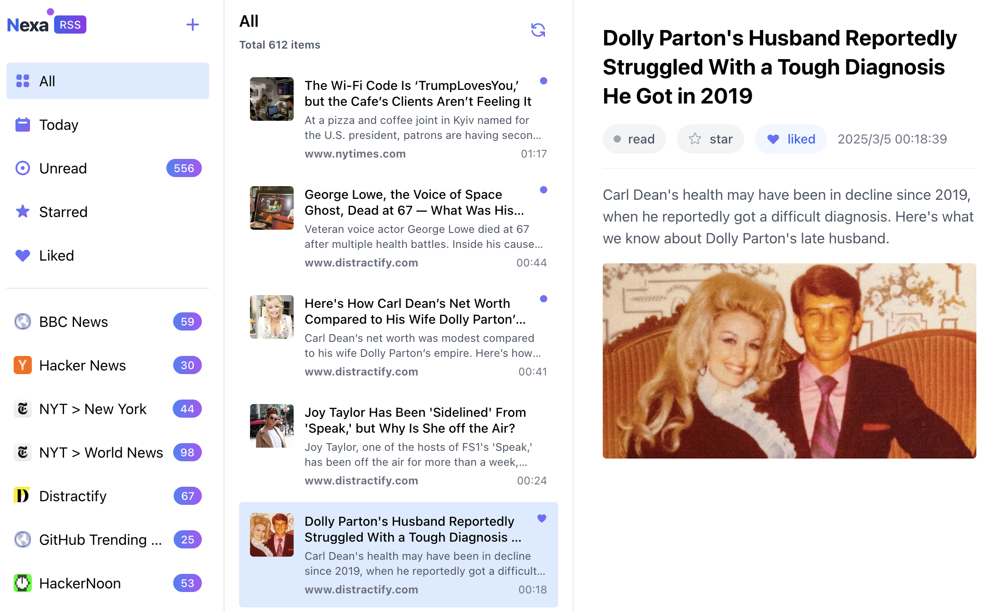
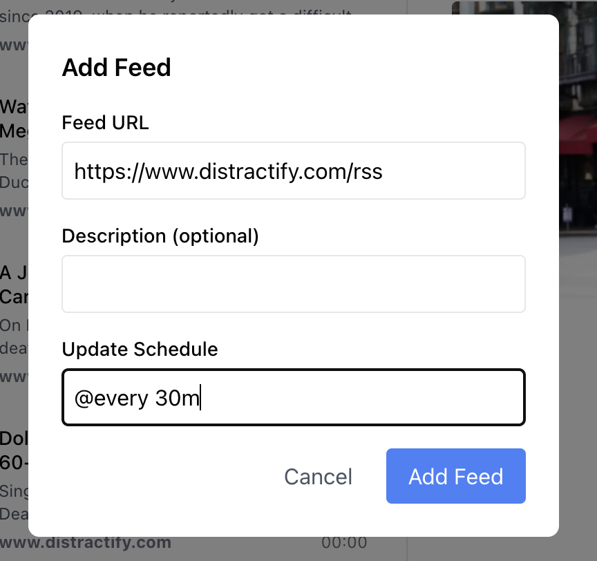

# Nexa

RSS reader built with a Go backend server, React frontend, and SQLite database.



## Docker Deployment

```bash
docker run -d -p 7766:7766 \
  -v $(pwd)/data:/app/data \
  -e NEXA_PASSWORD=yourpassword \
  --name nexa \
  callmemhz/nexa:latest
```

This will:
- Map port 7766 to your host, which is the application's web interface
- Mount a volume for persistent data storage (SQLite database will be stored in the ./data directory)
- Set a password for authentication (leave NEXA_PASSWORD empty to disable login requirement)
- Support customizable fetch frequency for each feed (set via cron expression when adding feeds)
  

### Access the application

Open your browser and navigate to:

```
http://localhost:7766
```
